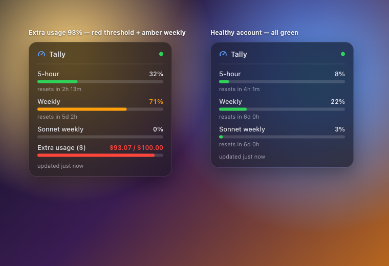

# Tally — Übersicht widget

A single-`.jsx` [Übersicht](https://tracesof.net/uebersicht/) desktop widget that
shows your Claude usage on the desktop, refreshing every **60 seconds** (the real
requirement — see `../../DECISIONS.md` ADR-002). It is the second Tally surface
after the menu bar app and reuses the same data layer (`tally-cli` / FetcherCore),
with a visual that mirrors the menu bar popover.



One row per usage window — label, percentage, and a bar colored by threshold
(**<60 green · 60–85 amber · >85 red**) — plus a relative reset (`resets in 2h 14m`)
and the overage line as `$93.07 / $100.00`. Errors (no credential, expired token)
render a clear message instead of breaking.

## Requirements

- macOS 14+ with [Übersicht](https://tracesof.net/uebersicht/) (`brew install --cask ubersicht`)
- Claude Code logged in (its OAuth token lives in the Keychain item `Claude Code-credentials`)
- Xcode Command Line Tools (`xcode-select --install`) to build `tally-cli`

## Install (recommended)

```sh
cd apps/ubersicht
./install.sh
```

It builds `tally-cli` (release), installs it to `~/.local/bin/tally-cli`, copies
`tally.jsx` + `tally-usage.sh` into the Übersicht widgets folder, smoke-tests the
wrapper, and tells you to install Übersicht if it's missing. Re-run any time —
it's idempotent.

## Manual install

Run every command from the **repo root** (so the relative paths below resolve).

1. **Build + install the CLI** (`--package-path core` keeps you at the repo root):
   ```sh
   swift build --package-path core -c release
   mkdir -p ~/.local/bin
   cp "$(swift build --package-path core -c release --show-bin-path)/tally-cli" ~/.local/bin/tally-cli
   ```
2. **Deploy the widget** into a folder named exactly `tally`:
   ```sh
   DST="$HOME/Library/Application Support/Übersicht/widgets/tally"
   mkdir -p "$DST"
   cp apps/ubersicht/tally.jsx apps/ubersicht/tally-usage.sh "$DST"/
   chmod +x "$DST/tally-usage.sh"
   ```
3. Open Übersicht (menu bar ▸ **Refresh All Widgets**). The card appears top-right.

> The folder **must** be named `tally`: `tally.jsx`'s `command` runs the wrapper
> by its absolute install path (`…/widgets/tally/tally-usage.sh`), which is robust
> regardless of Übersicht's working directory. If you rename the folder, update
> that one line in `tally.jsx`.

## How it works

```
tally.jsx ──command──▶ tally-usage.sh ──▶ tally-cli --json        (PRIMARY)
                                     └──▶ curl /api/oauth/usage    (FALLBACK)
       ◀──── stdout JSON ────────────────┘
render({ output }) → parse JSON → draw rows
```

`tally-usage.sh` always prints valid JSON on stdout:

- **Primary:** runs `tally-cli --json`, passed through verbatim (the normalized
  `{providerId, displayName, capturedAt, metrics[]}` snapshot). `tally-cli` is
  searched on `PATH`, then `/usr/local/bin`, `~/.local/bin`, the dev release
  build (`core/.build/release`), and next to the script.
- **Fallback:** if `tally-cli` is nowhere to be found, it `curl`s
  `api.anthropic.com/api/oauth/usage` directly — reading the token from the
  Keychain (`security find-generic-password -s "Claude Code-credentials" -w`,
  `jq` to extract `claudeAiOauth.accessToken`) and sending the mandatory
  `User-Agent: claude-code/<version>` header — then normalizes the raw response
  (via `jq`) into the **same** shape, tagged `"source":"curl-fallback"`.
- **On error** it emits `{"error":"…"}`, which the widget renders as a message.

The token is **never** printed. The default install path (`tally-cli` in
`~/.local/bin`) means the widget works even though GUI apps don't inherit your
shell `PATH`.

## Preview without Übersicht

Open `preview.html` in a browser. It embeds two sample snapshots (a heavy account
hitting the red threshold and a healthy one) and renders the **same** CSS/markup
as the widget over a busy wallpaper, so you can calibrate the look offline.

```sh
open apps/ubersicht/preview.html
```

## Customize

- **Position:** edit `top` / `right` in `tally.jsx`'s `className` (Übersicht
  positions widgets absolutely).
- **Thresholds / colors:** the `barColor` / `valueColor` helpers in `tally.jsx`
  (keep `preview.html` in sync).

## Troubleshooting

| Symptom | Fix |
| --- | --- |
| "Can't read usage — … token expired" | Re-authenticate: run `claude` and log in. |
| "Can't read usage — no Claude Code credential" | Log into Claude Code so the Keychain item exists. |
| Widget blank / "starting…" forever | Check the wrapper directly: `"$HOME/Library/Application Support/Übersicht/widgets/tally/tally-usage.sh"`. |
| `tally-cli` not found (uses slow curl fallback) | Run `./install.sh` (installs to `~/.local/bin`). |
